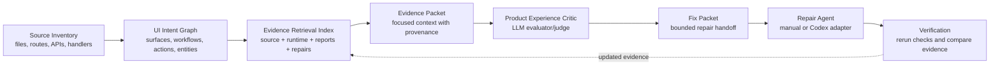

## One-Sentence Architecture

Sniffer is an evidence-gathering agent that observes source code and runtime UI, asks an LLM to judge product/workflow alignment, then produces bounded repair packets that humans or coding agents can apply and verify.

# Sniffer Agent Architecture

Sniffer is an agentic UI QA system. It is not a generic crawler that clicks every link and emits a pass/fail log. Its job is to build enough context to understand what a UI is trying to support, exercise that UI safely, evaluate the result against source/runtime/product evidence, and hand actionable repair packets to a human or coding agent.

The core loop is:

```text
target project
  -> source discovery
  -> runtime DOM discovery
  -> crawl and scenario execution
  -> product intent modeling
  -> workflow/product/UX critics
  -> evidence-gated issues
  -> fix packets
  -> human or Codex repair
  -> verification
  -> updated report history
```

This is agentic because Sniffer maintains task context, uses tools, produces structured intermediate state, asks an LLM judge for product-level evaluation when configured, gates findings against evidence, and supports a repair/verification loop. The LLM is not allowed to directly mutate the app. It evaluates structured context and returns structured decisions.

## System Boundaries

Sniffer has three major execution surfaces:

- CLI: `src/cli/index.ts` orchestrates commands such as `discover`, `crawl`, `audit`, `generate-fixes`, `apply-fix`, `verify`, `repair-loop`, and `verify-matrix`.
- Runtime agent core: `src/discovery`, `src/runtime`, `src/critic`, `src/heuristics`, `src/repair`, `src/reporting`, and `src/verification`.
- Dashboard/control plane: `server/uiServer.ts`, `server/repairWorkbench.ts`, `server/artifacts.ts`, and `ui/src/components/*`.

The target app and target repo are separate from Sniffer. Sniffer reads source, drives a browser with Playwright, writes reports under `reports/sniffer/...`, and only applies code changes through explicit repair commands and agent adapters.

## Source Discovery As Multi-Layer Agent Context

Source discovery is Sniffer's first context-building step, but it is not just static file scanning. It is a multi-layer context system that turns files into source-grounded task context for crawling, scenario generation, Product Experience Critic calls, fix packets, and repair verification.

Relevant modules:

- `src/discovery/sourceDiscovery.ts`
- `src/discovery/reactUiDiscovery.ts`
- `src/heuristics/productIntent.ts`
- `src/profile/appProfile.ts`
- `src/projects/registry.ts`

Sniffer separates source context into three layers.

### 1. Source Inventory

The Source Inventory is deterministic fact extraction from the repo. It should not overclaim product semantics.

It records facts such as:

- framework and build tool
- files, modules, components, templates, pages, routes, and forms
- API calls and endpoint strings
- state/action hints such as `useState` names, handler names, submit handlers, loading states, and error states
- imported modules and component/template relationships where available

This layer answers: "What is present in the code?" It should not answer: "What product workflow is definitely supported?" For example, a file named `PlanRunsPanel.tsx` is an inventory fact; "users can browse previous plan runs and reopen one" is an intent-graph inference that needs more evidence.

### 2. UI Intent Graph

The UI Intent Graph is the normalized user-facing model. This is the semantic core of source discovery.

It contains:

- UI surfaces: app shells, navigation, selectors, lists, cards, tables, panels, dialogs, tabs, copy areas, generated-output panels, raw JSON panels
- workflows: user jobs inferred from controls, handlers, routes, forms, API calls, and runtime corroboration
- user actions: click, type, select, submit, copy, open, close, filter, search, generate, refresh, reopen
- forms and controls with labels, placeholders, roles, `aria-label`s, and `data-testid`s
- validation, loading, and error state hints
- API/data dependencies connected to workflows
- entities such as workspace, project, repo target, plan run, report, issue, fix packet, screenshot, or user/account
- provenance back to source files, snippets, adapters, routes, and confidence

Routes are entrypoints. Source files are provenance. UI surfaces and workflows are the canonical semantic units.

This distinction matters. File-based-only modeling is weak because many modern apps place most UI behavior in one large component, generated templates, shared render helpers, or framework-specific files. Route-based-only modeling is weak because single-page apps can expose most behavior behind tabs, dialogs, sidebars, panels, stateful controls, and hash-less button navigation. A useful UI QA agent needs to understand surfaces and workflows, not just files and URLs.

All framework adapters should emit this same neutral model. React, Angular, Vue, Svelte, jQuery, and vanilla HTML adapters can parse different source formats, but their output should normalize into the same `SourceGraph` concepts: inventory facts, UI surfaces, source workflows, forms, controls, state/actions, API calls, evidence, confidence, and provenance.

### 3. Evidence Retrieval Index

The Evidence Retrieval Index is the RAG layer over everything Sniffer has observed or produced.

It indexes:

- source snippets and Source Inventory facts
- UI Intent Graph nodes and edges
- runtime DOM snapshots and locator inventories
- screenshot metadata and artifact URLs
- crawl states and action transitions
- scenario traces, steps, assertions, and failures
- reports and prior findings
- critic decisions and deferred findings
- fix packets and repair attempts
- verification results

This does not replace the `SourceGraph`; it sits above it. The `SourceGraph` remains the source-grounded model. The retrieval index selects focused context from source, runtime, report history, and repair history so the Product Experience Critic, fix-packet generator, repair workbench, and future agent loop receive small, evidence-backed packets rather than the whole repo.

Evidence packets should preserve the origin and confidence of each item:

- deterministic facts: directly extracted from files or DOM
- heuristic inferences: rule-based conclusions with evidence and confidence
- LLM annotations: structured judgments from a provider, never treated as direct proof
- runtime confirmations: observed controls, states, screenshots, errors, and scenario outcomes

These categories must remain separate. Merging them into one undifferentiated "truth" makes hallucination control harder and makes false positives harder to debug.



In agent terms, this is context retrieval and preprocessing. It is similar to RAG, except the retrieved context is local source structure and source intent rather than unstructured documents. Sniffer keeps this context deterministic and reproducible so later LLM calls have grounded evidence.

The important output is not "files found"; it is "what the UI appears to be built to do."

## Runtime Crawling As Tool Use

Sniffer uses Playwright as its main external tool. Runtime crawling loads the app, observes the DOM, clicks safe controls, records state transitions, and captures screenshots.

Relevant modules:

- `src/runtime/crawler.ts`
- `src/runtime/domSnapshot.ts`
- `src/runtime/runtimeAppModel.ts`
- `src/runtime/safeActions.ts`
- `src/runtime/scenarioSelection.ts`
- `src/runtime/generatedScenarioExecutor.ts`
- `src/runtime/workflowVerifier.ts`
- `src/runtime/locatorRepair.ts`

The crawler records:

- URL, title, hash route, and inferred screen name
- DOM summaries: headings, landmarks, links, buttons, inputs, forms, tables, tabs, dialogs, roles, labels, placeholders, and test ids
- locator candidates ordered by reliability: role/name, label, placeholder, test id, text fallback, CSS fallback
- console errors and network failures
- screenshots before/after important states or actions
- actions attempted, actions skipped, safe/unsafe classifications, changed-state flags, duplicate-state handling, and unvisited safe actions

In agent terms, Playwright is a tool. Sniffer does not treat browser actions as blind exploration. It builds an action frontier, applies a safe-action policy, deduplicates repeated actions, prioritizes unexplored navigation, and records the reason for each action or skip.

## Screenshots, DOM, And Scenario Traces As Evidence

Sniffer's reports are evidence stores, not just summaries. Each finding should be traceable to observed artifacts.

Evidence artifacts include:

- `source_graph.json`
- `crawl_graph.json`
- `runtime_dom_snapshot.json`
- `app_intent.json`
- `latest_report.json`
- `latest_report.md`
- scenario screenshots
- crawl state screenshots
- Playwright traces where available
- repair attempt logs
- verification results

Relevant modules:

- `src/reporting/paths.ts`
- `src/reporting/json.ts`
- `src/reporting/reportWriter.ts`
- `server/artifacts.ts`
- `ui/src/components/ScreenshotGallery.tsx`
- `ui/src/components/ScreenshotModal.tsx`
- `ui/src/components/CrawlPathView.tsx`
- `ui/src/components/ScenariosView.tsx`

Scenario execution creates higher-value evidence than a raw crawl. A scenario trace records the user job being tested, prerequisites, steps, locators used, URL/state before and after, screenshots, failed assertions, network activity, and related issues.

This gives the LLM critic and the human reviewer a concrete session replay:

```text
screen -> action -> state change -> evidence -> assertion -> finding
```

## Product Intent Model As Task Understanding

The product intent model is Sniffer's representation of the task environment. It answers: what kind of app is this, what entities matter, what jobs are users trying to complete, and what workflows are expected?

Relevant modules:

- `src/heuristics/productIntent.ts`
- `src/profile/appProfile.ts`
- `src/runtime/runtimeAppModel.ts`
- `src/runtime/genericScenarios.ts`
- `src/runtime/scenarios.ts`

The model can include:

- app category, such as `planning_control_panel`, `admin_console`, `dashboard_app`, `crud_app`, `auth_app`, or `unknown`
- app subtype, such as `sniffer_dashboard` when evidence supports it
- core entities, such as project, report, issue, fix packet, screenshot, run, workspace, repo target, plan run, or plan bundle
- primary user jobs
- expected navigation model
- expected persistence/history model
- expected output review model
- evidence, assumptions, confidence, and hallucination risks

This is the agent's task understanding layer. It prevents Sniffer from applying the wrong scenario pack to the wrong app. For example, a planning control panel is a broad profile, but workspace-control plan-bundle scenarios should not run against the Sniffer Dashboard unless source/runtime evidence supports that specific workflow.

## Product Experience Critic As LLM Evaluator

The Product Experience Critic is the LLM-centered evaluator for product-level QA. It is not a generic visual lint pass. Its question is:

```text
Given what this app is trying to do, the current workflow, the screenshot,
DOM summary, page intent, scenario trace, and product UX rubric, does this
screen make sense for the user job being tested?
```

Relevant modules:

- `src/critic/productExperienceCritic.ts`
- `src/critic/contextBuilder.ts`
- `src/critic/workflowCritic.ts`
- `src/critic/uxCritic.ts`
- `src/llm/provider.ts`
- `src/llm/openAICompatibleProvider.ts`
- `src/llm/mockProvider.ts`
- `src/llm/factory.ts`

The critic builds a `ProductExperienceContext` for each important screen:

- app name, profile, subtype, and product intent summary
- screen name, nav label, page intent, workflow intent, and scenario step
- user goal if provided
- expected user questions, required context, and expected next actions
- screenshot path and artifact URL
- DOM summary, headings, controls, status text, empty states, errors, and active nav state
- report/run/project context
- source/runtime evidence
- related issues and fix packets

When configured for LLM mode, the critic calls the real provider and expects strict JSON. The result includes:

- classification: `aligned`, `minor_gap`, `major_gap`, or `inconclusive`
- confidence
- findings with type, severity, expected behavior, observed behavior, evidence, why it matters, suggested fix, and `should_report`
- non-issues with reasons they were not reported

The Product Experience Critic is where Sniffer catches product-level issues that a locator-based test often misses, such as:

- a "Run Timeline" page that loads but does not identify which run is shown
- a screenshot modal that displays an image without scenario/state/action context
- a graph explorer that is technically present but not interpretable
- an empty issues page that says nothing is wrong without explaining what was checked
- raw JSON being available while the human-readable explanation is missing

## Evidence Gating As Hallucination Control

LLM output is not accepted directly as truth. Sniffer gates candidate findings before they become reportable issues or fix packets.

Relevant modules:

- `src/critic/workflowCritic.ts`
- `src/critic/productExperienceCritic.ts`
- `src/heuristics/issueClassifier.ts`
- `src/heuristics/issueTriage.ts`
- `src/heuristics/runtimeSurfaceMatcher.ts`
- `src/heuristics/runtimeDomQuality.ts`

Evidence gating checks:

- Is the finding tied to the screen actually reviewed?
- Is the screenshot/DOM/scenario evidence local to the claim?
- Does source or runtime evidence contradict the finding?
- Is the issue a real bug, conditional UI, missing precondition, bad locator, inconclusive result, or request for more crawling?
- Is the suggested next action safe under Sniffer's policy?
- Is the finding actionable enough to generate a fix packet?
- Is the issue duplicated by another finding with the same endpoint pattern, workflow, or UX theme?

Example: if the critic says "Raw JSON is missing a Copy JSON control," but the runtime evidence for the Raw JSON screen shows `Copy JSON`, Sniffer suppresses the finding as contradictory instead of reporting a product bug.

This is the main hallucination-control mechanism. The LLM can judge, but it must be evidence-backed.

## Fix Packets As Structured Agent Handoff

Fix packets convert findings into repair-ready tasks. They are designed for humans and coding agents.

Relevant modules:

- `src/repair/fixPackets.ts`
- `src/repair/issueMetadata.ts`
- `src/repair/pathPolicy.ts`
- `src/repair/safety.ts`

A fix packet contains:

- issue id and title
- repo path and repair root
- allowed paths
- evidence paths
- suspected files
- prompt
- constraints
- verification command
- pass conditions

The prompt is intentionally scoped and evidence-driven. It should include the observed problem, affected URLs or screens, screenshots/traces, suspected files, expected behavior, and safety constraints.

In agent terms, a fix packet is a structured handoff message. It turns Sniffer's QA context into a bounded implementation task for a repair agent without giving that agent unbounded authority.

## Repair Loop As Human-In-The-Loop Agent Workflow

Sniffer's repair loop is an agent workflow with explicit approval and verification boundaries.

Relevant modules:

- `src/repair/agentAdapters.ts`
- `src/repair/applyFix.ts`
- `src/repair/repairLoop.ts`
- `src/repair/verify.ts`
- `server/repairWorkbench.ts`
- `ui/src/components/RepairWorkbench.tsx`

The adapter interface supports:

- manual mode: print or display the fix packet, no edits
- mock mode: deterministic test adapter
- Codex CLI mode: invoke a configured local Codex command

The repair loop records:

- git status before
- command run
- stdout and stderr
- changed files
- diff summary
- repair attempt directory
- verification command
- verification result

This is human-in-the-loop by default:

- the browser never receives API keys
- manual mode is the safe default
- Codex must be configured explicitly
- destructive operations require explicit confirmation
- only one repair runs at a time by default
- verification is separate from repair

In agent terms, this is workflow orchestration with tool use, approval gates, memory, and post-action evaluation.

## Dashboard As Agent Control Plane

The Sniffer Dashboard is the local control plane for the agent.

Relevant modules:

- `server/uiServer.ts`
- `server/repairWorkbench.ts`
- `ui/src/App.tsx`
- `ui/src/components/AuditLauncher.tsx`
- `ui/src/components/ProjectsView.tsx`
- `ui/src/components/RunTimeline.tsx`
- `ui/src/components/ScenariosView.tsx`
- `ui/src/components/CrawlPathView.tsx`
- `ui/src/components/WorkflowEvidenceView.tsx`
- `ui/src/components/IssueSummary.tsx`
- `ui/src/components/FixPacketViewer.tsx`
- `ui/src/components/RepairWorkbench.tsx`
- `ui/src/components/DiscoveryGraph.tsx`

The dashboard exposes:

- project registration and selection
- audit launch configuration
- live run status
- report summaries
- run timelines
- scenario traces
- crawl paths
- workflow evidence
- issues and triaged repair groups
- screenshots and artifacts
- fix packets
- repair attempts, logs, diffs, and verification
- raw JSON for debugging

In agent terms, the dashboard is not just a report viewer. It is the operator console for an agentic workflow: configure context, launch tools, inspect evidence, approve repairs, and verify results.

## Subsystems Mapped To AI-Agent Concepts

| Sniffer subsystem | Files/modules | Agent concept | Concrete role |
| --- | --- | --- | --- |
| Source discovery | `src/discovery/*`, `src/heuristics/productIntent.ts` | Multi-layer context construction | Builds Source Inventory facts, normalizes them into the UI Intent Graph, and feeds the Evidence Retrieval Index. |
| Project registry | `src/projects/registry.ts` | Memory/index | Stores target projects, repo paths, app URLs, framework profile, latest report, and run context. |
| Runtime DOM snapshot | `src/runtime/domSnapshot.ts` | Observation | Captures the current environment state: DOM, accessibility names, controls, forms, tables, tabs, screenshots. |
| Playwright crawler | `src/runtime/crawler.ts` | Tool use | Drives the browser with safe actions and records state transitions, errors, screenshots, and skipped actions. |
| Safe action policy | `src/runtime/safeActions.ts`, `src/repair/safety.ts` | Safety guardrail | Blocks destructive UI actions and unsafe repair requests unless explicitly allowed. |
| Scenario selection/execution | `src/runtime/scenarioSelection.ts`, `src/runtime/generatedScenarioExecutor.ts`, `src/runtime/scenarios.ts` | Workflow orchestration | Chooses scenario packs based on evidence, executes steps, captures traces, and avoids wrong-context failures. |
| Locator inventory/repair | `src/runtime/locatorRepair.ts` | Tool self-correction | Generates and repairs Playwright locator candidates using DOM evidence and optional LLM assistance. |
| Workflow Critic | `src/critic/workflowCritic.ts` | Structured evaluator | Classifies workflow findings as real bugs, conditional UI, bad tests, missing preconditions, or inconclusive. |
| Product Experience Critic | `src/critic/productExperienceCritic.ts` | LLM judge | Evaluates screens against product/page/workflow intent and returns structured product-experience findings. |
| UX/runtime heuristics | `src/heuristics/uxHeuristics.ts`, `src/heuristics/runtimeDomQuality.ts` | Candidate generator | Produces evidence-backed candidates such as overflow, ambiguous names, repeated text, suspicious visibility, and accessibility risks. |
| Issue classifier/triage | `src/heuristics/issueClassifier.ts`, `src/heuristics/issueTriage.ts`, `src/heuristics/endpointGrouping.ts` | Evidence gating and deduplication | Converts raw findings into fewer actionable repair groups and suppresses contradictions or weak claims. |
| Reports | `src/reporting/*` | Memory/report history | Persists structured artifacts, Markdown summaries, screenshots, traces, critic decisions, fix packets, and verification records. |
| Fix packets | `src/repair/fixPackets.ts` | Structured agent handoff | Turns evidence-gated issues into bounded prompts with suspected files, constraints, and pass conditions. |
| Agent adapters | `src/repair/agentAdapters.ts` | Tool adapter | Normalizes manual, mock, and Codex repair execution behind one interface. |
| Apply fix/repair loop | `src/repair/applyFix.ts`, `src/repair/repairLoop.ts` | Human-in-the-loop action loop | Applies a selected fix through an adapter, records diffs/logs, and supports iterative repair. |
| Verification | `src/repair/verify.ts`, `src/verification/matrix.ts` | Eval loop | Re-runs targeted or matrix checks to decide whether evidence disappeared or failures remain. |
| Dashboard server | `server/uiServer.ts`, `server/artifacts.ts`, `server/repairWorkbench.ts` | Agent API/control server | Exposes local endpoints for audits, reports, artifacts, fix packets, repairs, logs, and verification without exposing secrets. |
| Dashboard UI | `ui/src/components/*` | Agent control plane | Lets an operator launch audits, inspect evidence, approve handoff, run repairs, view diffs, and rerun verification. |

## Structured Outputs

Sniffer uses structured data throughout the pipeline. This is critical for both automation and hallucination control.

Important structured artifacts:

- `SourceGraph`: source-discovered framework, UI surfaces, workflows, API calls, state/action hints
- `Source Inventory`: deterministic file/module/template/route/API/state facts with no semantic overclaiming
- `UI Intent Graph`: normalized surfaces, workflows, user actions, controls, entities, data dependencies, and provenance
- `Evidence Retrieval Index`: retrievable source/runtime/report/repair evidence used to build focused context packets
- `Evidence Packet`: selected source snippets, graph nodes, DOM evidence, screenshots, scenario traces, prior findings, and repair history for a specific critic or repair task
- `RuntimeDomSnapshot`: current rendered DOM, controls, forms, labels, roles, screenshots, locator candidates
- `RuntimeAppModel`: runtime-inferred app type, screens, workflows, actions, route candidates
- `CrawlGraph`: states, actions, screenshots, errors, transitions, skipped actions
- `ProductIntentModel`: app category, primary user jobs, entities, expected workflows, evidence, assumptions
- `ProductExperienceContext`: page/workflow/screenshot/DOM/report context sent to the Product Experience Critic
- `WorkflowCriticDecision`: real bug, conditional UI, precondition needed, test bug, inconclusive, or more crawling needed
- `Issue`: evidence-backed, typed, severity-ranked finding
- `FixPacket`: bounded repair handoff with prompt and verification conditions
- `AgentResult`: repair adapter output with stdout, stderr, changed files, diff summary, and status
- `VerificationResult`: fixed, still failing, or inconclusive

Structured output is how Sniffer avoids turning LLM prose into unbounded behavior.

## Evals And Verification

Sniffer verifies itself at multiple levels:

- unit tests for discovery, safe actions, state hashing, heuristics, reports, fix packets, agent adapters, and repair behavior
- Playwright-backed runtime audits
- generated scenarios and scenario runs
- targeted issue verification with `sniffer verify`
- matrix verification with `sniffer verify-matrix`
- dogfood runs against the Sniffer Dashboard

Verification is part of the agent loop. A repair is not treated as complete because an agent wrote code. It is complete when the relevant evidence disappears and no new severe regression appears.

## Memory And Report History

Sniffer's memory is local and file-based:

- project registry
- per-project latest reports
- per-run reports where configured
- screenshots and trace artifacts
- repair attempts
- verification records
- matrix reports

This gives the dashboard and repair loop continuity across runs without requiring a hosted database.

## Why This Is Not Just A Crawler

A crawler records pages and links. Sniffer records intent, evidence, and decisions.

The key differences are:

- It reads source before runtime and uses that source as context.
- It infers workflows and product jobs, not only URLs.
- It executes safe scenarios with assertions and screenshots.
- It uses LLM evaluation for product-experience judgment when configured.
- It evidence-gates LLM output before reporting bugs.
- It groups raw findings into repair themes.
- It emits fix packets that coding agents can act on.
- It verifies whether repairs actually removed the evidence.
- It exposes the whole loop through a local dashboard.

The intended operating model is:

```text
Sniffer observes -> Sniffer judges with evidence -> human approves -> agent fixes -> Sniffer verifies
```

That makes Sniffer an agentic QA system with controlled tool use and human-in-the-loop repair, not an autonomous crawler with a bug list.
