# Sniffer

Sniffer is a context-aware UI QA agent. It is designed to understand what a UI is trying to help a user do, execute the app with Playwright, and report likely real product/UI bugs with evidence.

It is not a dumb crawler. The current architecture is evidence-first and LLM-centered when an LLM is configured:

1. Collect evidence from source discovery, runtime DOM snapshots, Playwright crawl states, scenarios, screenshots, console/network events, and report metadata.
2. Build intent context: app profile, product intent, page intent, workflow intent, expected user questions, visible controls, and scenario traces.
3. Use the LLM as the primary Product Experience Critic when `--product-experience-critic llm` is enabled.
4. Evidence-gate LLM findings so contradictory runtime/source evidence suppresses false positives.
5. Generate grouped issues, fix packets, and verification paths only for findings that remain evidence-backed.

Sniffer still supports fully deterministic/no-key audits for discovery, crawl, generic scenario execution, accessibility checks, and rule-based issue classification. That mode is useful for CI and local smoke testing. The product-level judgment layer, however, is intentionally LLM-centered when configured.

Sniffer does not perform destructive actions by default.

## Install

```bash
npm install
npm run build
```

## Sniffer Dashboard UI

Sniffer includes a local-only dashboard for launching audits, polling run status, and reading reports without opening JSON files by hand.

Build the UI and start the local API/static server:

```bash
npm install
npm --prefix ui install
npm run ui:build
npm run ui:server
```

Then open:

```text
http://127.0.0.1:4877
```

For UI development, run the API server and Vite dev server in separate terminals:

```bash
npm run ui:server
npm --prefix ui run dev
```

The Vite dashboard runs at `http://127.0.0.1:4878` and proxies `/api` to the local Sniffer server.

The dashboard provides:

- Run launcher for repo path, app URL, scenario mode, critic mode, UX critic, intent mode, provider, product goal, max iterations, and consistency checks.
- Story-first report navigation: Summary, Run Timeline, Scenarios, Crawl Path, Workflow Evidence, Issues, Fix Packets, Screenshots, Graph Explorer, and Raw JSON.
- A shared report context strip on report/evidence pages so users can always see the current project/ad hoc label, selected/latest report identity, generated timestamp, status, app URL, repo path, scenario count, issue count, screenshot count, and Product Experience Critic status.
- Live run status through polling, with the current phase and recent logs shown in the Run Timeline view.
- Run Timeline phase cards for source discovery, runtime crawl, scenario execution, critics, product intent analysis, issue grouping, and fix packet generation.
- Scenario detail replay with prerequisites, step/assertion evidence, status chips, and inline screenshot previews.
- Crawl Path replay showing visited URLs/hashes, visible controls grouped by kind, safe actions attempted, repeated unchanged actions, screenshots, console errors, and network failures.
- Workflow Evidence view connecting source intent, source files, expected actions, runtime verification, related API calls, scenarios, critic decisions, and issues.
- Scoped Discovery Graph explorer with pan/zoom, minimap, controls, search, filters, legend, and node detail panels. It defaults to a crawl graph and supports Workflow graph, Issue graph, Crawl graph, Source intent graph, and Full graph (advanced) modes.
- Report summary cards, issue groups, issue detail, fix prompt copy actions, and issue verification launch.
- Fix packet list/detail view with compact report context, repair status, suspected files, prompt, verification, constraints, and raw packet sections.
- Screenshot/evidence gallery.
- Settings view for LLM/agent configured status.
- A lightweight inline SVG golden retriever mascot that animates while Sniffer is running.

The UI never receives API keys. It only displays configured/unconfigured status, model name, and API style as reported by the local Node server. The server shells out to existing Sniffer CLI commands and captures stdout/stderr. It prevents concurrent audit runs by default and does not auto-apply fixes.

## Commands

```bash
npm run sniffer -- init-project --id workspace-control --name "Workspace Control" --repo ../web --url http://localhost:3000
npm run sniffer -- projects list
npm run sniffer -- projects inspect --id workspace-control
npm run sniffer -- projects remove --id workspace-control
npm run sniffer -- inspect-url --url http://localhost:3000
npm run sniffer -- inspect-url --project workspace-control
npm run sniffer -- discover --project workspace-control
npm run sniffer -- crawl --project workspace-control
npm run sniffer -- audit --project workspace-control --discovery-mode hybrid --scenario all
npm run sniffer -- audit --project sample-app --discovery-mode hybrid --scenario all --execute-generated-scenarios
npm run sniffer -- discover --repo ../web
npm run sniffer -- crawl --url http://localhost:3000
npm run sniffer -- audit --repo ../web --url http://localhost:3000 --discovery-mode hybrid
npm run sniffer -- audit --repo ../web --url http://localhost:3000 --scenario all --ux-critic deterministic
npm run sniffer -- audit --repo ../web --url http://localhost:3000 --scenario generate-plan-bundle
npm run sniffer -- audit --repo ../web --url http://localhost:3000 --critic-mode deterministic
npm run sniffer -- audit --repo ../web --url http://localhost:3000 --scenario all --execute-generated-scenarios --provider openai-compatible --product-experience-critic llm
npm run sniffer -- generate-fixes --report reports/sniffer/latest/latest_report.json
npm run sniffer -- apply-fix --issue <issue_id> --report reports/sniffer/latest/latest_report.json --agent manual
npm run sniffer -- verify --issue <issue_id> --url http://localhost:3000 --report reports/sniffer/latest/latest_report.json
npm run sniffer -- repair-loop --repo ../web --url http://localhost:3000 --agent manual --max-iterations 3
npm run sniffer -- generate-tests --repo ../web --url http://localhost:3000
npm run sniffer -- run-tests
```

## Multi-Project Mode

Sniffer can register multiple UI targets so audits, reports, screenshots, fix packets, and dashboard views are scoped by project.

The project registry is local JSON:

```text
.sniffer/projects.json
```

Register a project:

```bash
npm run sniffer -- init-project \
  --id workspace-control \
  --name "Workspace Control" \
  --repo /path/to/workspace-control/web \
  --url http://127.0.0.1:5173
```

Then run project-aware commands:

```bash
npm run sniffer -- projects list
npm run sniffer -- discover --project workspace-control
npm run sniffer -- crawl --project workspace-control
npm run sniffer -- audit --project workspace-control --scenario all
```

Direct mode still works:

```bash
npm run sniffer -- audit --repo /path/to/ui-repo --url http://localhost:3000
```

Direct runs are stored under `reports/sniffer/ad_hoc/latest/` and also mirrored to `reports/sniffer/latest/` for backwards compatibility.

Project-scoped reports use:

```text
reports/sniffer/<project_id>/latest/
reports/sniffer/<project_id>/runs/<run_id>/
```

`init-project` inspects `package.json`, detects React/Vite, Next.js, Angular, Vue, Svelte, or unknown projects where possible, infers dev/build/test commands, runs source discovery, and saves an initial app profile.

## App Profiles And Generic Scenarios

Sniffer infers a target-agnostic `AppProfile` from source workflows, UI surfaces, API calls, state names, route/nav labels, visible text, and optional product goal context.

Profile types include:

- `planning_control_panel`
- `admin_console`
- `dashboard_app`
- `crud_app`
- `ecommerce_app`
- `docs_site`
- `marketing_site`
- `auth_app`
- `unknown`

The profile drives generic scenario generation such as navigation smoke tests, form discoverability, no-console/network checks, accessibility label checks, overflow/readability checks, CRUD create/detail discoverability, auth form checks, and planning/control-panel output/history/copy flows. Common-pattern-only expectations are suggestions unless source, runtime, or user evidence supports reporting them as issues.

The dashboard top bar includes a project selector, and the Projects page lets you add/select/audit registered projects without exposing secrets to the browser.

## Source Discovery As Agent Context

Source discovery is not just static file scanning. Sniffer treats it as a multi-layer agent context system:

1. Source Inventory
   - deterministic facts extracted from files
   - files, modules, components, templates, routes, API calls, state variables, handlers, forms, and imports
   - no semantic overclaiming

2. UI Intent Graph
   - normalized user-facing model
   - UI surfaces, workflows, user actions, forms, controls, state, validation, APIs, data dependencies, and entities
   - source files are provenance
   - routes are entrypoints
   - surfaces and workflows are the canonical semantic units

3. Evidence Retrieval Index
   - RAG layer over source snippets, UI graph nodes, runtime DOM, screenshot metadata, scenario traces, reports, prior findings, fix packets, repair attempts, and verification results
   - used by the Product Experience Critic, fix-packet generator, Repair Workbench, and future agent loops

File-based-only modeling is weak because many apps keep most behavior in one large component, template, or render helper. Route-based-only modeling is weak because SPAs often hide important behavior behind tabs, dialogs, sidebars, button navigation, and stateful panels. Sniffer therefore treats a UI surface plus its workflow as the canonical unit of meaning.

Deterministic facts, heuristic inferences, LLM annotations, and runtime confirmations must remain separate:

- deterministic facts come directly from source files or rendered DOM
- heuristic inferences are rule-based and carry evidence/confidence
- LLM annotations are structured judgments, not proof
- runtime confirmations are observed states, controls, screenshots, errors, and scenario outcomes

This supports actual RAG without replacing the `SourceGraph`. The `SourceGraph` remains the source-grounded model; the Evidence Retrieval Index selects focused source/runtime/report/repair context into an evidence packet for a specific critic or repair task.

```mermaid
flowchart LR
  A["Source Inventory<br/>files, routes, APIs, handlers"] --> B["UI Intent Graph<br/>surfaces, workflows, actions, entities"]
  B --> C["Graph Structure Critic<br/>LLM suggestions + guarded application"]
  C --> D["UI Intent Graph Refined<br/>provenance preserved"]
  D --> E["Evidence Retrieval Index<br/>source + runtime + reports + repairs"]
  E --> F["Evidence Packet<br/>focused context with provenance"]
  F --> G["Product Experience Critic<br/>LLM evaluator/judge"]
  G --> H["Fix Packet<br/>bounded repair handoff"]
  H --> I["Repair Agent<br/>manual or Codex adapter"]
  I --> J["Verification<br/>rerun checks and compare evidence"]
  J -. "updated evidence" .-> E
```



## Graph Structure Critic

The optional Graph Structure Critic is an early LLM-powered refinement stage:

```text
SourceInventory
-> UIIntentGraphDraft
-> GraphStructureCritic
-> UIIntentGraphRefined
-> EvidenceRetrievalIndex
```

It reviews a compact Source Inventory and UI Intent Graph draft and returns structured `GraphRefinementSuggestion` objects. It can suggest corrections such as:

- reclassifying `/src/main.tsx` from an API call into a `static_asset_reference`
- normalizing raw JSX control strings into clean labels, handlers, control types, and test IDs
- reclassifying `Plan Runs history` from `unknown_ui_section` to `history_list`
- connecting `onReopenPlanRun` and `/plan-runs` evidence to a “Browse/reopen previous plan runs” workflow
- marking repeated row actions like `Reopen` as scoped row actions rather than globally unique buttons

The LLM does not directly overwrite deterministic facts. Sniffer applies only suggestions that are:

- schema-valid
- `confidence=high`
- `risk=low|medium`
- tied to an existing `targetId`
- backed by existing `evidenceIds`
- not contradicted by deterministic source evidence

Raw facts are never deleted. If a fact is noisy, Sniffer marks it `suppressedFromSemanticGraph=true` and keeps it in Source Inventory for debugging/provenance. Applied refinements produce new LLM-attributed facts or graph metadata with references back to the original evidence.

Run it explicitly:

```bash
npm run sniffer -- audit \
  --repo /path/to/ui-repo \
  --url http://localhost:3000 \
  --discovery-mode hybrid \
  --scenario all \
  --execute-generated-scenarios \
  --provider openai-compatible \
  --graph-refiner llm
```

Or use mock mode for local tests:

```bash
npm run sniffer -- discover --repo /path/to/ui-repo --graph-refiner llm --provider mock
```

Reports include a `Graph Structure Critic` section with mode, provider/model, suggestion counts, applied refinements, rejected refinements, and warnings. JSON reports include the full `graphRefinement` result.

## Source Discovery Adapters

Source discovery is framework-adapter based. Each adapter emits the same neutral `SourceGraph` model so the rest of Sniffer does not depend on React-specific code paths.

- `ReactDiscoveryAdapter` for JSX/TSX component surfaces, state hooks, handlers, forms, and API calls.
- `AngularDiscoveryAdapter` for Angular component classes, component templates, routes, form bindings, click/submit handlers, services, and `HttpClient` calls.
- `HtmlTemplateDiscoveryAdapter` as a lower-confidence fallback for `.html`, `.vue`, `.svelte`, `.astro`, `.hbs`, and `.ejs` templates.
- Future Vue, Svelte, jQuery, and vanilla adapters should emit the same neutral model: inventory facts, UI surfaces, source workflows, forms, controls, state/actions, API calls, evidence, confidence, and provenance.

The adapter runner:

- detects package/framework signals from `package.json`, `angular.json`, routes, component files, and template files
- runs all applicable adapters
- runs the generic template fallback whenever template files are present
- merges duplicate routes, forms, workflows, API calls, UI surfaces, and state/action hints
- preserves `discoveredBy`, framework, confidence, and evidence on normalized graph items

Reports include a `Discovery Adapters` section with adapter confidence/evidence and separate workflow counts for source-discovered workflows, runtime-discovered workflows, generated scenarios, and executed scenarios.

For arbitrary apps, prefer hybrid discovery and generic scenario execution:

```bash
npm run sniffer -- audit \
  --repo /path/to/app \
  --url http://localhost:4200 \
  --discovery-mode hybrid \
  --scenario all \
  --execute-generated-scenarios
```

For an Angular app:

```bash
npm run sniffer -- audit \
  --repo /Users/taimurkhaliq/ai_projects/angular-realworld-example-app \
  --url http://localhost:4200 \
  --discovery-mode hybrid \
  --scenario all \
  --execute-generated-scenarios \
  --critic-mode deterministic \
  --ux-critic deterministic \
  --intent-mode deterministic
```

Expected report shape for a healthy arbitrary-app run:

```json
{
  "sourceWorkflows": 6,
  "runtimeWorkflows": 2,
  "generatedScenarios": 7,
  "scenarioRuns": 7,
  "discoveryAdapters": ["angular", "html-template"]
}
```

If `sourceWorkflows` is low but `runtimeWorkflows` or `generatedScenarios` are present, that is not an empty discovery. It means Sniffer is relying on runtime DOM discovery and generated generic scenarios instead of static source workflows.

## Runtime DOM Discovery

For arbitrary apps, Sniffer can inspect the running URL first instead of assuming source structure:

```bash
npm run sniffer -- inspect-url --url http://localhost:4200
npm run sniffer -- audit --project sample-app --discovery-mode runtime --scenario auto
npm run sniffer -- audit --project sample-app --discovery-mode hybrid --scenario auto --execute-generated-scenarios
npm run sniffer -- audit --project sample-app --discovery-mode hybrid --intent-mode llm --critic-mode llm --scenario auto --execute-generated-scenarios
```

Discovery modes:

- `source`: use source discovery only.
- `runtime`: infer from the rendered app URL and skip source assumptions.
- `hybrid`: merge source discovery, runtime DOM discovery, crawl evidence, and optional LLM inference.

Runtime inspection writes:

```text
reports/sniffer/<project_id>/latest/runtime_dom_snapshot.json
reports/sniffer/<project_id>/latest/runtime_dom_snapshot.html
reports/sniffer/<project_id>/latest/runtime_app_model.json
reports/sniffer/<project_id>/latest/screenshots/initial.png
```

The runtime DOM snapshot captures URL/title, cleaned HTML/text, headings, landmarks, links, buttons, inputs, selects, textareas, forms, tables, tabs, dialogs, visible text blocks, disabled state, bounding boxes, ARIA labels, placeholders, `data-testid` values, roles, screenshot path, safe action classification, and Playwright locator candidates.

Locator candidates are ordered by reliability:

1. `getByRole(role, { name })`
2. `getByLabel(label)`
3. `getByPlaceholder(placeholder)`
4. `getByTestId(testid)`
5. `getByText(text)`
6. CSS selector fallback

When LLM runtime inference is enabled with `--intent-mode llm|auto` or `--use-llm`, Sniffer sends a compact context packet containing project metadata, source summary, runtime controls/forms/nav/table/dialog evidence, screenshot metadata, and safe candidate actions. The LLM returns structured JSON only: app type, user jobs, evidence-backed workflows, safe next actions, unsafe actions, and locator suggestions. The LLM does not execute actions; the safe action policy remains authoritative.

Runtime reports now include:

- Discovery Adapters
- Workflow Discovery Sources
- Runtime DOM Discovery
- Inferred Runtime App Model
- Locator Inventory
- LLM Inferred Workflows
- Safe/Unsafe Action Plan
- Crawl Coverage
- Locator Failures / Repairs
- Generated Scenarios
- Scenario Execution Coverage

## Verification Matrix

Use the matrix to prove Sniffer still works across multiple app shapes and its own dashboard:

```bash
npm run verify:matrix
```

This is equivalent to:

```bash
npm run sniffer -- verify-matrix
```

The matrix currently covers:

- `workspace-control-web`: the workspace-control React/Vite app, when `http://127.0.0.1:5173` is reachable.
- `sample-angular-app`: `/Users/taimurkhaliq/ai_projects/angular-realworld-example-app`, when `http://localhost:4200` is reachable.
- `tiny-react-fixture`: a self-contained React/Vite source fixture served by the matrix runner.
- `static-html-fixture`: a self-contained static HTML/template fixture served by the matrix runner.
- `sniffer-dashboard-ui`: Sniffer's own dashboard, served locally from `ui/dist` when the UI has been built.

External target URLs can be overridden:

```bash
SNIFFER_MATRIX_WORKSPACE_URL=http://127.0.0.1:5173 \
SNIFFER_MATRIX_ANGULAR_REPO=/path/to/angular-app \
SNIFFER_MATRIX_ANGULAR_URL=http://localhost:4200 \
npm run verify:matrix
```

For each target, the matrix runs:

```bash
sniffer audit \
  --discovery-mode hybrid \
  --scenario all \
  --execute-generated-scenarios \
  --critic-mode deterministic \
  --ux-critic deterministic \
  --intent-mode deterministic
```

It writes:

```text
reports/sniffer/matrix/latest_matrix.json
reports/sniffer/matrix/latest_matrix.md
reports/sniffer/matrix/targets/<target_id>/
```

Expected console shape:

```text
Verification matrix PASSED
- PASS tiny-react-fixture: react / crud_app · source=... runtime=... generated=... runs=... issues=... groups=... fixes=... screenshots=...
- PASS static-html-fixture: unknown / crud_app · source=... runtime=... generated=... runs=... issues=... groups=... fixes=... screenshots=...
- SKIP workspace-control-web: App URL not reachable: http://127.0.0.1:5173
- PASS dogfood: http://127.0.0.1:<port>
Wrote reports/sniffer/matrix/latest_matrix.md
```

Matrix pass criteria:

- framework is detected, or `unknown` is handled gracefully for static/template apps
- `sourceWorkflows + runtimeWorkflows > 0`
- generated scenarios are present
- executed scenario runs are present when generic execution is enabled
- report file exists
- screenshots directory exists
- report text does not say `No workflows` when runtime workflows were discovered

The matrix also records real issue count, triaged repair group count, generated fix packet count, and screenshot count for each target. Those counts are not pass/fail criteria by themselves; they are there to make regressions obvious.

Failing counts usually mean:

- `runtimeWorkflows = 0`: the app URL did not render useful controls, or the runtime DOM model needs more generic heuristics.
- `generatedScenarios = 0`: app profile inference did not find enough navigation/form/list/auth/dashboard evidence.
- `scenarioRuns = 0`: run with `--execute-generated-scenarios`, or check that the target URL is reachable.
- `framework` mismatch: static adapter detection missed the framework/package signals.
- `fixPackets = 0`: the run had no actionable repair groups, or `generate-fixes` could not produce a safe packet.
- high `issues` with passing matrix criteria: Sniffer is functioning, but the target has reported QA findings to inspect.

To add a new matrix target, add a `MatrixTarget` entry in `src/verification/matrix.ts` with repo path, app URL, expected framework/profile, and minimum workflow/scenario counts. Prefer low minimums for arbitrary apps and rely on the detailed target report for quality.

The matrix also dogfoods the Sniffer UI. It starts the local dashboard server when `ui/dist/index.html` exists and verifies that the dashboard loads, project selector is visible, run launcher is visible, report navigation is visible, and Timeline/Crawl/Graph/Screenshots/Fix Packet pages open without crashing.

## No-Key Deterministic Audit

Start the target app separately, then run:

```bash
npm run sniffer -- audit --repo /path/to/ui-repo --url http://localhost:3000
```

This mode does not require an LLM key. It still performs source/runtime discovery, safe crawling, generic scenario generation, deterministic UX/accessibility checks, issue grouping, screenshots, and reports. It should be treated as a reliable baseline, not the deepest product judgment Sniffer can make.

This writes reports to:

```text
reports/sniffer/ad_hoc/latest/
  source_graph.json
  app_profile.json
  app_intent.json
  crawl_graph.json
  latest_report.md
  latest_report.json
  fix_prompts.md
  fix_packets/
  repair_attempts/
  verification/
  screenshots/
  traces/
  generated_tests/
```

## LLM Mode

LLM mode is where Sniffer's product-level review becomes most useful. Deterministic mode remains available and requires no API keys, but the Product Experience Critic is designed to use a real LLM as the primary evaluator when configured.

Create a local `.env` or export these variables:

```bash
export SNIFFER_LLM_BASE_URL=https://api.openai.com/v1
export SNIFFER_LLM_API_KEY=...
export SNIFFER_LLM_MODEL=...
export SNIFFER_LLM_API_STYLE=responses
```

Then run a product-experience audit:

```bash
npm run sniffer -- audit \
  --repo /path/to/ui-repo \
  --url http://localhost:3000 \
  --scenario all \
  --execute-generated-scenarios \
  --provider openai-compatible \
  --product-experience-critic llm
```

Keys are used only by the Node CLI process. Sniffer never sends secrets to browser or client code.

### Configuring Product Experience Critic LLM

The Product Experience Critic is LLM-first when you run it in `llm` mode. It does not silently fall back to mock or deterministic judgment if the real provider fails.

Preferred environment variables:

```bash
export SNIFFER_LLM_BASE_URL="https://api.openai.com/v1"
export SNIFFER_LLM_API_KEY="..."
export SNIFFER_LLM_MODEL="gpt-4.1-mini"
export SNIFFER_LLM_API_STYLE="responses"
```

Fallback order:

- base URL: `SNIFFER_LLM_BASE_URL`, `STACKPILOT_SEMANTIC_BASE_URL`, then `https://api.openai.com/v1`
- API key: `SNIFFER_LLM_API_KEY`, `STACKPILOT_SEMANTIC_API_KEY`, then `OPENAI_API_KEY`
- model: `SNIFFER_LLM_MODEL`, then `STACKPILOT_SEMANTIC_MODEL`
- API style: `SNIFFER_LLM_API_STYLE`, `STACKPILOT_SEMANTIC_API_STYLE`, then `auto`

Check the provider before running a long audit:

```bash
npm run sniffer -- providers check --provider openai-compatible
```

The check prints the provider, base URL host, model, API style, which env vars are present, whether auth is configured, request success/failure, and the HTTP status/error summary. It never prints the API key.

Then run the critic:

```bash
npm run sniffer -- audit \
  --repo /path/to/ui-repo \
  --url http://localhost:3000 \
  --scenario all \
  --execute-generated-scenarios \
  --provider openai-compatible \
  --product-experience-critic llm
```

If the provider check fails, fix the env vars first. In `llm` mode Sniffer marks the Product Experience Critic as `provider_error` instead of pretending a mock or deterministic review succeeded.

## Product Experience Critic

The Product Experience Critic is an intent-aware product QA layer. It asks:

```text
Given what this app is trying to do, does this screen make sense for the user job being tested?
```

It is separate from the workflow critic, UX heuristics, and prompt/output consistency checks. In `llm` mode it uses the configured LLM as the primary evaluator; deterministic checks are used as context builders, safety guardrails, candidate generators, and fallback only when LLM mode is not requested.

Run it with executed scenarios so the critic sees actual reached screens instead of only the initial DOM:

```bash
npm run sniffer -- audit \
  --repo /path/to/ui-repo \
  --url http://localhost:3000 \
  --scenario all \
  --execute-generated-scenarios \
  --provider openai-compatible \
  --product-experience-critic llm
```

The critic builds one `ProductExperienceContext` per important screen. For Sniffer Dashboard this includes Summary, Run Timeline, Scenarios, Crawl Path, Workflow Evidence, Issues, Fix Packets, Screenshots, Graph Explorer, Raw JSON, and Settings.

Each context includes:

- app profile/subtype and product intent
- page intent and workflow intent
- expected user questions, expected primary content, required context, and expected next actions
- scenario name/step when available
- screenshot path and artifact URL
- DOM summary, headings, visible controls, visible status text, errors, and empty states
- active nav/page label
- report/run/project context visibility
- source/runtime evidence and candidate findings
- context sufficiency score and warnings

Reports include a `Product Experience Critic` section for every reviewed screen:

- LLM used and real LLM used
- provider/model/API style
- vision used or the reason it was not used
- context sufficiency
- scenario screenshot used
- classification: `aligned`, `minor_gap`, `major_gap`, or `inconclusive`
- evidence-backed findings and non-issues

Current OpenAI-compatible provider behavior sends DOM/context plus screenshot paths/artifact URLs. The wrapper reports `vision_used=false` until a vision-capable provider implementation is wired in; it does not pretend screenshot pixels were reviewed.

Guardrails prevent common dogfood false positives:

- Loaded report issue titles, fix-packet titles, raw findings, deferred findings, and `runtimeSurfaceMatches` inside a report are treated as report data, not proof that the dashboard chrome has the same defect.
- Raw JSON is judged by whether the Raw JSON page exposes the payload and copy action, not by embedded issues inside the payload.
- If vision is not used, visual hierarchy/prominence claims must be backed by DOM evidence or are suppressed.
- If visible DOM contradicts a finding, such as `Copy JSON` being visible while a model says no copy action exists, the finding is suppressed.

Dogfood Sniffer on the dashboard:

```bash
npm run sniffer -- providers check --provider openai-compatible
npm run sniffer -- audit \
  --repo /Users/taimurkhaliq/ai_projects/stackpilot-workspace/workspace-control/sniffer/ui \
  --url http://127.0.0.1:4877 \
  --scenario all \
  --execute-generated-scenarios \
  --product-experience-critic llm \
  --provider openai-compatible \
  --ux-critic deterministic \
  --intent-mode deterministic \
  --critic-mode deterministic \
  --max-actions 36 \
  --max-states 24
```

Expected healthy dogfood shape:

```json
{
  "issues": 0,
  "rawFindings": 0,
  "generatedScenarios": 14,
  "scenarioRuns": 14,
  "passedScenarioRuns": 12,
  "blockedScenarioRuns": 2,
  "productExperience": {
    "status": "completed",
    "providerName": "openai-compatible",
    "realLlmScreensReviewed": 11,
    "visionScreensReviewed": 0
  }
}
```

## What Sniffer Collects

Source discovery builds multi-layer context:

- Source Inventory facts from `package.json`, framework/build config, source files, templates, routes, components, forms, API calls, state variables, and handlers.
- UI Intent Graph nodes for user-facing surfaces, workflows, forms, controls, state, validation, data dependencies, entities, and route entrypoints.
- Evidence Retrieval Index entries that can later be selected into evidence packets for critics, fix packets, repair workbench views, and verification.

Framework adapters are only extraction mechanisms. React, Angular, Vue, Svelte, jQuery, and vanilla adapters should all emit the same neutral `SourceGraph` concepts so downstream crawling, scenario selection, evidence retrieval, and LLM evaluation do not depend on framework-specific code paths.

Runtime crawling opens the app with Playwright and collects:

- title and URL
- console errors
- network failures
- visible buttons, links, tabs, inputs, forms, and dialogs
- safe navigation and tab/dialog interactions
- visited states, state hashes, actions, and screenshots

## Workflow Critic

Sniffer runs candidate findings through a workflow critic before turning them into report issues or fix packets.

Default deterministic critic:

```bash
npm run sniffer -- audit \
  --repo /path/to/ui-repo \
  --url http://localhost:3000 \
  --critic-mode deterministic
```

Mock LLM critic for local testing:

```bash
npm run sniffer -- audit \
  --repo /path/to/ui-repo \
  --url http://localhost:3000 \
  --use-llm \
  --provider mock \
  --critic-mode llm
```

Provider flags:

- `--critic-mode deterministic|llm|auto`
- `--provider mock|openai-compatible|auto`
- `--use-llm`
- `--max-iterations`

The critic receives a focused context packet per finding: app identity, relevant source intent, runtime controls, screenshots paths, console/network errors, crawl actions, inferred app state, and the candidate finding. It returns structured JSON decisions such as `real_bug`, `crawler_needs_precondition`, `needs_more_crawling`, or `inconclusive`.

Conditional UI is deferred instead of reported when a precondition is missing. For example, missing Raw JSON before a plan bundle exists is treated as `crawler_needs_precondition` with `next_safe_action=generate_plan_bundle_with_sample_prompt`, not as a fix-packet-worthy bug. API/console 500s still report as real bugs.

## Scenario Packs And UX Audit

Sniffer can run safe workflow scenarios instead of only inspecting the first visible DOM state.

For workspace-control/planning-control-panel apps, `--scenario all` runs the built-in workflow pack:

```bash
npm run sniffer -- audit \
  --repo /path/to/ui-repo \
  --url http://localhost:3000 \
  --scenario all \
  --ux-critic deterministic
```

Built-in scenarios cover workspace-control style apps:

- create/select workspace
- add repo target
- validate local repo path
- refresh discovery
- refresh learning
- generate plan bundle
- review plan output tabs
- copy handoff prompt
- inspect raw JSON
- semantic enrichment toggle

For arbitrary apps, Sniffer generates generic scenarios from the app profile, source adapters, and runtime DOM model. Use `--execute-generated-scenarios` to execute them:

```bash
npm run sniffer -- audit \
  --repo /path/to/ui-repo \
  --url http://localhost:4200 \
  --discovery-mode hybrid \
  --scenario all \
  --execute-generated-scenarios \
  --ux-critic deterministic
```

Generated generic scenarios include:

- navigation smoke test
- forms discoverability
- accessibility labels check
- overflow/readability check
- login form discoverability when auth controls are detected
- table/list scan when lists, feeds, tables, or repeated cards are detected
- CRUD list/create/detail smoke tests when create/edit/detail signals exist
- tab switching when tabs are detected

If generated scenarios exist but `scenarioRuns` is `0`, run again with `--execute-generated-scenarios`. The dashboard Scenarios page shows generated scenarios as planned/not executed instead of hiding them.

Scenario execution only performs safe actions: selecting visible workspace/repo controls, opening modals, typing the sample prompt `Add OwnersPage (no actions yet)`, clicking generate/refresh-style actions, opening tabs, and clicking copy controls. It does not delete, reset, overwrite, or submit destructive actions.

Run a single scenario:

```bash
npm run sniffer -- audit \
  --repo /path/to/ui-repo \
  --url http://localhost:3000 \
  --scenario generate-plan-bundle

npm run sniffer -- audit \
  --repo /path/to/ui-repo \
  --url http://localhost:3000 \
  --scenario review-plan-output
```

Deterministic UX/accessibility checks look for:

- duplicate workspace names without disambiguation
- plus-only or unnamed buttons
- inputs/selects/textareas without accessible labels
- dialogs without labels
- duplicate DOM IDs
- jammed text such as `PetClinic local4/25/2026`
- horizontal overflow and long paths that do not wrap/truncate
- missing empty/loading states
- unclear primary actions
- disabled controls without guidance
- handoff/raw JSON output without copy affordances
- oversized plan output without tabs/collapsible sections

Optional LLM UX critique is separate from the workflow critic:

```bash
npm run sniffer -- audit \
  --repo /path/to/ui-repo \
  --url http://localhost:3000 \
  --scenario all \
  --ux-critic llm \
  --provider openai-compatible \
  --use-llm
```

The UX critic receives compact context: app purpose, source workflow, visible controls, screenshot paths, DOM text summary, known state, and deterministic candidate UX issues. It returns structured JSON findings only. Screenshots are referenced by path; Sniffer does not send browser-side secrets.

Reports include separate sections for Functional/API issues, Workflow scenario failures, UX/layout issues, Accessibility issues, Deferred/conditional findings, LLM UX critic findings, and Fix packets.

## Issue Triage

Sniffer keeps detailed raw findings, but the user-facing report and fix packets are built from triaged repair groups.

The report summary includes:

- raw findings count
- triaged issues / repair groups count
- functional/API issues
- workflow scenario issues
- UX/layout issues
- accessibility issues
- raw findings appendix

Examples of repair groups:

- API endpoint failures
- Add repo workflow discoverability
- Plan output review/copy workflow
- Repository/workspace list readability
- Accessibility/copy affordance cleanup
- Loading/error state cleanup

If workflow verification found a control but a scenario later failed to locate it, Sniffer marks that raw scenario finding as inconclusive and notes that the scenario locator may be too strict. Those raw findings remain in the appendix but do not create standalone fix packets.

API evidence includes normalized endpoint patterns, method, status code, affected URLs, target ids when available, and response body text when Playwright can safely read it.

When `--critic-mode llm`, `--ux-critic llm`, or `--product-experience-critic llm` is enabled and the provider supports it, Sniffer can ask the LLM to interpret findings in context and group them into repair themes. Deterministic grouping remains available as a fallback for no-key runs.

## Repair Loop

Sniffer can turn audit issues into structured fix packets, but it does not blindly edit code itself.

The loop is:

```text
audit -> issue diagnosis -> fix packet -> agent/manual fix -> verify -> fixed or still failing
```

Generate fix packets after an audit:

```bash
npm run sniffer -- generate-fixes --report reports/sniffer/latest/latest_report.json
```

This writes:

```text
reports/sniffer/latest/fix_packets/<issue_id>.md
reports/sniffer/latest/fix_packets/<issue_id>.json
```

Apply a fix manually:

```bash
npm run sniffer -- apply-fix \
  --issue <issue_id> \
  --report reports/sniffer/latest/latest_report.json \
  --agent manual
```

Manual mode prints the Codex-ready packet and does not modify files.

For a dry-run repair proof that writes a machine-readable result without invoking an agent:

```bash
npm run sniffer -- repair-proof \
  --issue <issue_id> \
  --report reports/sniffer/latest/latest_report.json \
  --agent manual
```

This loads the existing fix packet and writes:

```text
reports/sniffer/latest/repair_attempts/<issue_id>/<timestamp>/repair_result.json
reports/sniffer/latest/repair_attempts/<issue_id>/<timestamp>/repair_result.md
```

Manual repair proof records:

- `agent_invoked=false`
- `changed_files=[]`
- `verification=not_run`
- repair root
- allowed paths
- fix packet path
- verification command

It does not modify code.

Use Codex mode only when configured. Sniffer writes the prompt to the repair attempt directory, runs Codex from `repair_root`, captures stdout/stderr, records git status/diff, and then you can run verification.

```bash
export SNIFFER_AGENT=codex
export SNIFFER_CODEX_COMMAND="codex --ask-for-approval never"
export SNIFFER_CODEX_ARGS="exec --sandbox workspace-write"
export SNIFFER_CODEX_TIMEOUT_SECONDS=900
npm run sniffer -- apply-fix \
  --issue <issue_id> \
  --report reports/sniffer/latest/latest_report.json \
  --agent codex
```

You can also provide a command template:

```bash
export SNIFFER_CODEX_COMMAND="codex --ask-for-approval never"
export SNIFFER_CODEX_ARGS="exec --sandbox workspace-write"
```

Sniffer writes `codex_prompt.md` into the repair attempt directory and pipes the prompt to stdin by default. If your command contains `{prompt_file}`, Sniffer replaces it with the generated prompt file path. For current Codex desktop CLI builds, `--ask-for-approval` is a global Codex flag and should appear before `exec`. If Codex is not installed or the command cannot be found, Sniffer prints clear instructions and does not run Codex.

Convenience scripts are also available:

```bash
npm run audit -- --repo /path/to/web --url http://localhost:3000 --critic-mode deterministic
npm run apply-fix -- --issue <issue_id> --report reports/sniffer/latest/latest_report.json --agent manual
npm run verify -- --issue <issue_id> --url http://localhost:3000 --report reports/sniffer/latest/latest_report.json
```

Verify an issue after a fix:

```bash
npm run sniffer -- verify \
  --issue <issue_id> \
  --url http://localhost:3000 \
  --report reports/sniffer/latest/latest_report.json
```

Run the full repair loop:

```bash
npm run sniffer -- repair-loop \
  --repo /path/to/ui-repo \
  --url http://localhost:3000 \
  --agent manual \
  --max-iterations 3 \
  --allow-destructive false
```

Repair attempts record git status before, git diff after, commands run, agent output, and verification results under `reports/sniffer/latest/repair_attempts/`.

## Known Limitations

- Framework adapters are heuristic and do not compile Angular/React/Vue/Svelte source.
- Runtime app profile inference can see secondary ecommerce/admin/dashboard words in report data; high-confidence source/product evidence takes precedence for the final app profile.
- Built-in workspace-control scenarios are only appropriate for planning/control-panel apps. Arbitrary apps should use hybrid discovery with generated generic scenarios.
- The OpenAI-compatible Product Experience Critic currently sends DOM/context and screenshot paths, not image pixels. Reports are explicit with `vision_used=false` until a vision-capable provider wrapper is implemented.
- LLM product judgments are evidence-gated. This suppresses self-referential report-data echoes, but it can also defer a legitimate subtle visual issue when only screenshot pixels could prove it.
- Matrix external targets are skipped, not failed, when their app URLs are not running.
- Manual repair proof proves packet handoff safety; it does not verify that a human or agent applied a fix.

Repair root and path safety:

- `repo_path` remains the scanned repo, such as `workspace-control/web`.
- `repair_root` is inferred from suspected files. If a fix needs `../server`, repair root becomes the parent project root.
- `allowed_paths` constrains modifications. For workspace-control learning-status issues, Sniffer allows `server/` and `web/src/`.
- Any new changed file outside `repair_root` or outside `allowed_paths` is blocked.

## Generated Tests

Generated Playwright specs are written to:

```text
reports/sniffer/latest/generated_tests/
```

They prefer accessible locators and stable user-visible assertions where possible.

## Safety Policy

Safe by default:

- click navigation, tabs, links
- open and close modals
- type temporary text into inputs
- click copy buttons

Unsafe unless explicitly allowed in a future implementation:

- delete, remove, reset, force, overwrite
- destructive repo operations
- permanent data mutation
- filesystem changes outside Sniffer reports and generated tests

Repair safety:

- fix packets include constraints and pass conditions
- destructive protected-data language is blocked unless `--allow-destructive true`
- manual mode never modifies files
- codex mode only runs when `SNIFFER_CODEX_COMMAND` is configured
- every repair attempt records git status, git diff, commands run, and verification results

## Limitations

Sniffer is still early. It can miss authenticated flows, role-specific UI, data-dependent states, canvas-heavy interfaces, workflows that require complex setup, and subtle visual problems that require actual image understanding. The Product Experience Critic is LLM-centered when configured, but its findings are not treated as proof by themselves: they are screened against DOM, source, scenario, screenshot-path, and runtime evidence before becoming issues or fix packets. Evidence-backed reports should still be reviewed by an engineer.
